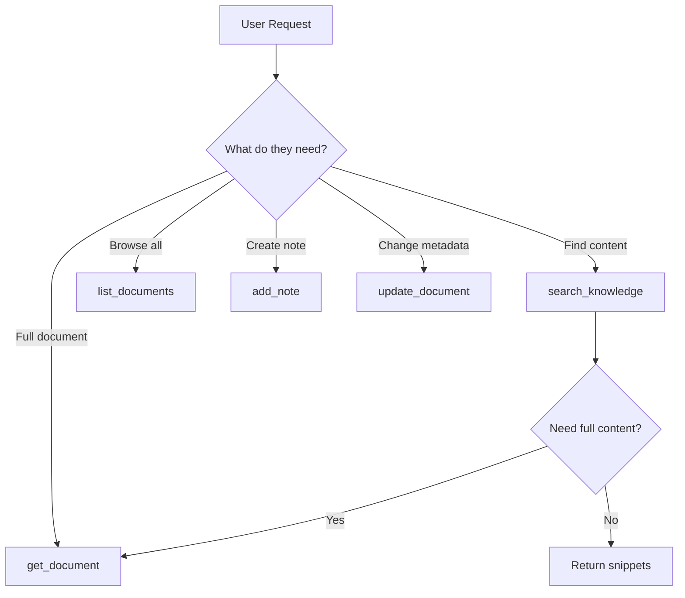

# Textrawl Documentation & Playground Framework

> A visually engaging, agent-friendly documentation and interactive playground for the Textrawl Personal Knowledge MCP Server.

## Executive Summary

This framework outlines the structure for creating modern, interactive documentation that serves both human developers and AI agents. Based on **January 2026** best practices, it combines:

- **Starlight (Astro) v0.37+** for blazing-fast, accessible documentation
- **MCP Playground** leveraging the mature MCP ecosystem (2,000+ servers in registry)
- **Agent-optimized content** with llms.txt, RFC 2119 language, and JSON schemas
- **"Imperfect by Design" aesthetics** with liquid glass effects (2026 trends)
- **AI chatbot integration** and cognitive accessibility features

### Key 2026 Context

- **MCP is now the de-facto standard** - Donated to Linux Foundation's Agentic AI Foundation (Dec 2025)
- **OpenAI officially adopted MCP** (March 2025) - Cross-platform compatibility
- **97M+ monthly SDK downloads** - Massive ecosystem growth
- **WCAG 2.1 AA compliance deadline: April 24, 2026** - Accessibility is mandatory

---

## Part 1: Documentation Framework

### Recommended Stack

| Layer | Technology | Why |
|-------|------------|-----|
| **Static Site Generator** | [Starlight v0.37+](https://starlight.astro.build/) (Astro) | Fastest performance, Island Architecture, <50KB first load, built-in dark mode + search |
| **API Reference** | [Scalar](https://scalar.com/) or [Mintlify](https://mintlify.com/) | OpenAPI integration, interactive explorer, modern UI |
| **Diagrams** | [Mermaid](https://mermaid.js.org/) + AI-assisted tools (Lucidchart, Miro) | Git version-controllable + AI auto-generation |
| **Code Playground** | [Sandpack 2.0](https://sandpack.codesandbox.io/) with Nodebox | Works in Safari/iOS, universal browser support |
| **MCP Playground** | [Cloudflare Workers AI Playground](https://blog.cloudflare.com/remote-model-context-protocol-servers-mcp/) or [Plugged.in](https://plugged.in/) | Purpose-built for MCP servers, remote testing |
| **Hosting** | Vercel, Netlify, or Cloudflare Pages | Fast CDN, free tier, automatic deploys |

### Alternative Stacks

**Option B: Mintlify (SaaS) - Recommended for API-first**
- Pros: Used by Cursor, Perplexity, Coinbase, Anthropic; beautiful defaults; AI-assisted writing
- Cons: ~$300/month Pro tier, managed platform
- Best for: Teams wanting premium aesthetics with minimal setup

**Option C: Docusaurus (React)**
- Pros: Mature ecosystem (61,800+ GitHub stars), proven at scale
- Cons: Higher JavaScript overhead (SPA architecture)
- Best for: Large projects with React expertise

**Note:** GitBook underwent major pricing restructure in 2025 (2-3x increase), causing many teams to migrate to alternatives.

---

## Part 2: Site Structure

```
docs.textrawl.dev/
├── / (Landing page with hero + features)
├── /getting-started/
│   ├── quick-start (5-minute setup)
│   ├── installation
│   ├── configuration
│   └── first-search (tutorial)
├── /mcp-tools/
│   ├── overview (tool selection guide)
│   ├── search-knowledge
│   ├── get-document
│   ├── list-documents
│   ├── update-document
│   └── add-note
├── /api-reference/
│   ├── authentication
│   ├── upload-endpoint
│   ├── health-endpoints
│   └── error-codes
├── /cli/
│   ├── overview
│   ├── mbox-conversion
│   ├── html-conversion
│   ├── takeout-import
│   ├── batch-upload
│   └── recipes (common patterns)
├── /web-ui/
│   ├── features
│   ├── drag-and-drop
│   └── auto-upload
├── /guides/
│   ├── email-import (Gmail walkthrough)
│   ├── pdf-knowledge-base
│   ├── search-optimization
│   └── deployment/
│       ├── docker
│       ├── cloud-run
│       └── security-hardening
├── /architecture/
│   ├── how-hybrid-search-works
│   ├── chunking-strategy
│   ├── embedding-providers
│   └── mcp-transport
├── /playground/ (Interactive demo)
├── /troubleshooting/
└── /changelog/
```

---

## Part 3: Interactive MCP Playground

### Architecture

```
┌─────────────────────────────────────────────────────────────────┐
│                      MCP Playground                              │
├─────────────────────────────────────────────────────────────────┤
│  ┌───────────────┐  ┌─────────────────────────────────────────┐ │
│  │ Tool Selector │  │            Request Builder              │ │
│  │               │  │                                         │ │
│  │ ○ search_     │  │  Query: [project timeline________]     │ │
│  │   knowledge   │  │  Limit: [10 ▼]                         │ │
│  │ ○ get_doc     │  │  Full-text Weight: [1.0 ────●────]     │ │
│  │ ○ list_docs   │  │  Semantic Weight:  [1.0 ────●────]     │ │
│  │ ○ update_doc  │  │  Tags: [emails] [work]  [+ Add]        │ │
│  │ ○ add_note    │  │                                         │ │
│  │               │  │  [Execute] [Copy as cURL] [View JSON]   │ │
│  └───────────────┘  └─────────────────────────────────────────┘ │
├─────────────────────────────────────────────────────────────────┤
│  ┌─────────────────────────────────────────────────────────────┐│
│  │                    Response Viewer                          ││
│  │                                                             ││
│  │  {                                                          ││
│  │    "results": [                                             ││
│  │      {                                                      ││
│  │        "id": "550e8400-e29b-41d4...",                       ││
│  │        "title": "Q3 Project Timeline",                     ││
│  │        "score": 0.87,                                       ││
│  │        "snippet": "The project is scheduled for..."        ││
│  │      }                                                      ││
│  │    ],                                                       ││
│  │    "total": 15                                              ││
│  │  }                                                          ││
│  │                                                             ││
│  │  Status: 200 OK  │  Time: 127ms  │  3 results              ││
│  └─────────────────────────────────────────────────────────────┘│
└─────────────────────────────────────────────────────────────────┘
```

### Key Features

1. **Tool Selector Panel**
   - Radio buttons for 5 MCP tools
   - Shows tool description on hover
   - Highlights required vs optional params

2. **Dynamic Form Builder**
   - Auto-generates UI from Zod schemas
   - Inline validation with helpful errors
   - Type-aware inputs (text, number, multi-select for tags)

3. **Request Preview**
   - "View JSON" shows raw MCP JSON-RPC payload
   - "Copy as cURL" for command-line testing
   - "Copy for Claude" formats as Claude Desktop prompt

4. **Response Visualization**
   - Syntax-highlighted JSON
   - Collapsible nested objects
   - Quick stats (status, latency, result count)
   - Error states with resolution hints

5. **Demo Mode**
   - Pre-populated sample data for first-time users
   - "Try example queries" buttons
   - No authentication required for read-only demo

### Implementation Options

**Option A: Cloudflare Workers MCP Playground (Recommended for 2026)**
- Use Cloudflare's remote MCP client infrastructure
- Built-in auth support, no local installation required
- Online chat interface for instant testing
- Leverage the MCP ecosystem's maturity

**Option B: Embedded in Docs**
```
/docs/playground/           → Full playground page
/docs/mcp-tools/search     → Embedded mini-playground per tool
```

**Option C: Plugged.in Integration**
- Comprehensive proxy combining multiple MCP servers
- Built-in playground for debugging
- Discovery and management of tools, prompts, resources

**Option D: Custom Standalone App**
- Separate subdomain: `playground.textrawl.dev`
- React SPA with Vite
- Two-panel layout (Stripe standard): explanations left, code right

### Technology Stack for Custom Playground

```typescript
// Stack
Framework: React 18 + TypeScript
Build: Vite
Styling: Tailwind CSS + shadcn/ui components
State: React Query (for API calls)
Forms: React Hook Form + Zod validation
Diagrams: Mermaid (embedded)
Code Display: Shiki (syntax highlighting)

// Key Dependencies
"@tanstack/react-query": "^5.x"
"react-hook-form": "^7.x"
"zod": "^3.x"
"shiki": "^1.x"
"mermaid": "^10.x"
```

---

## Part 4: Agent-Friendly Documentation

### 2026 Reality Check: llms.txt Adoption

**Current state (as of Jan 2026):**
- Only ~784 websites (0.3% of top 1,000) have implemented llms.txt
- Major AI companies have NOT officially committed to using llms.txt files
- Google explicitly rejected it (Gary Illyes, July 2025)

**However, still implement it because:**
- Google included llms.txt in their A2A (Agents to Agents) protocol
- Foundation for future standards evolution
- Good content curation practice regardless of AI adoption
- MCP ecosystem benefits from structured discovery

### Files to Create

#### 1. `/llms.txt` - AI Sitemap
```markdown
# Textrawl - Personal Knowledge MCP Server
> Hybrid semantic + full-text search over documents for Claude

## MCP Server Capabilities
- Protocol: Model Context Protocol (MCP) via StreamableHTTPServerTransport
- Transport: Stateless HTTP (serverless-compatible)
- Authentication: Bearer token (API_BEARER_TOKEN)

## Tools (RFC 2119 Language)
- search_knowledge: MUST provide query; MAY specify weights, tags, limits
- get_document: MUST provide documentId; MAY request chunks
- list_documents: MAY filter by sourceType, tags; SHOULD paginate
- update_document: MUST provide documentId; MAY update title, tags
- add_note: MUST provide title, content; MAY add tags

## Documentation
- /README.md: Overview, features, quick start
- /CLAUDE.md: AI coding assistant instructions (RECOMMENDED for agents)
- /docs/CLI.md: Command-line tools
- /docs/SECURITY.md: Row Level Security
- /docs/MCP-TOOLS.md: Complete MCP tool reference with JSON schemas
- /api/schema: Machine-readable tool definitions (JSON)

## Quick Facts
- 5 MCP tools available
- Embedding providers: OpenAI (1536 dim) or Ollama (1024 dim)
- Database: Supabase PostgreSQL with pgvector
- Rate limits: API 100/min, Upload 10/min
- Node.js requirement: >= 22.0.0
```

#### 2. `/llms-full.txt` - Consolidated Docs
Single file containing all documentation concatenated for single-request AI ingestion.

#### 3. `/api/schema` - Machine-Readable Tool Definitions
Expose JSON schemas at runtime for dynamic agent discovery.

#### 3. Enhanced `/CLAUDE.md` Additions

```markdown
## Quick Reference Values

| Metric | Value |
|--------|-------|
| Max chunk size | 512 tokens (~2048 chars) |
| Chunk overlap | 50 tokens |
| OpenAI embeddings | 1536 dimensions |
| Ollama embeddings | 1024 dimensions |
| API rate limit | 100 req/min |
| Upload rate limit | 10 req/min |
| Node.js version | >= 22.0.0 |

## Tool Selection Guide



## Common Agent Patterns

### Pattern 1: Search and Retrieve
1. Call `search_knowledge` with user's query
2. If user wants details, call `get_document` for top result
3. Summarize content for user

### Pattern 2: Knowledge Capture
1. Call `add_note` with user's content
2. Return document ID for reference
3. Optionally search to verify indexing

### What NOT to Do
- ❌ `search_knowledge` with empty query (rejected)
- ❌ `limit > 50` (max is 50)
- ❌ Both weights at 0 (no results possible)
- ❌ `update_document` on immutable fields (source_type, created_at)
```

#### 4. `/docs/MCP-TOOLS.md` - Complete Tool Reference

Structure for each tool:
```markdown
## search_knowledge

### Purpose
Hybrid semantic + full-text search using Reciprocal Rank Fusion.

### When to Use
- Finding documents by meaning ("emails about project risks")
- Finding exact phrases ("Q3 financial targets")
- Combining both ("reviews of the new proposal")

### Parameters

| Name | Type | Required | Default | Description |
|------|------|----------|---------|-------------|
| query | string | ✅ | - | Search query (non-empty) |
| limit | number | | 10 | Max results (1-50) |
| fullTextWeight | number | | 1.0 | Keyword match weight (0-2) |
| semanticWeight | number | | 1.0 | Meaning match weight (0-2) |
| tags | string[] | | - | Filter by tags |
| sourceType | string | | - | Filter: "file", "note", "email" |
| minScore | number | | 0 | Minimum relevance threshold |

### JSON Schema
```json
{
  "type": "object",
  "properties": {
    "query": { "type": "string", "minLength": 1 },
    "limit": { "type": "number", "minimum": 1, "maximum": 50, "default": 10 },
    "fullTextWeight": { "type": "number", "minimum": 0, "maximum": 2 },
    "semanticWeight": { "type": "number", "minimum": 0, "maximum": 2 }
  },
  "required": ["query"]
}
```

### Example Request
```json
{
  "jsonrpc": "2.0",
  "method": "tools/call",
  "params": {
    "name": "search_knowledge",
    "arguments": {
      "query": "project timeline Q4",
      "limit": 5,
      "semanticWeight": 1.2
    }
  }
}
```

### Example Response
```json
{
  "results": [
    {
      "id": "550e8400-e29b-41d4-a716-446655440000",
      "title": "Q4 Planning Document",
      "score": 0.89,
      "snippet": "The Q4 project timeline begins in October..."
    }
  ],
  "total": 12
}
```

### Error Scenarios

| Error | Cause | Resolution |
|-------|-------|------------|
| ValidationError | Empty query | Provide non-empty query string |
| ValidationError | limit > 50 | Reduce limit to 50 or less |
| RateLimitError | >100 req/min | Implement exponential backoff |
```

---

## Part 5: Visual Design System

### 2026 Design Trends

**"Imperfect by Design"** - 2026 is the year of human-centered aesthetics:
- Moving away from sterile corporate perfection
- Embracing organic, personal visual tones
- Custom illustrations over generic icons

**Key Visual Patterns:**
- **Liquid Glass / Glassmorphism** - Translucent overlays, frosted backgrounds
- **Monospaced Typography** - Beyond code blocks, into headings and UI
- **Two-Panel Layout** (Stripe standard) - Explanations left, code right
- **AI Chatbot Integration** - Embedded assistants in docs (Docker, Netlify pattern)
- **Cognitive Accessibility** - Design for ADHD, autism, dyslexia

### Color Palette (Dark Mode Default)

```css
/* Based on 2026 trends: liquid glass + subtle gradients */

:root {
  /* Backgrounds - Use dark grays, not pure black */
  --bg-primary: #0a0a0f;      /* Main background */
  --bg-secondary: #12121a;    /* Cards, sidebars */
  --bg-tertiary: #1a1a24;     /* Elevated surfaces */

  /* Text - Soften white for readability */
  --text-primary: #e4e4e7;    /* Main text */
  --text-secondary: #a1a1aa;  /* Muted text */
  --text-muted: #71717a;      /* Very subtle */

  /* Accent - Neon blue/purple gradient */
  --accent-primary: #6366f1;  /* Indigo */
  --accent-secondary: #8b5cf6; /* Violet */
  --accent-glow: rgba(99, 102, 241, 0.2);

  /* Semantic */
  --success: #22c55e;
  --warning: #f59e0b;
  --error: #ef4444;
  --info: #3b82f6;

  /* Code blocks */
  --code-bg: #1e1e2e;
  --code-border: #313244;
}

/* Light mode (toggle available) */
[data-theme="light"] {
  --bg-primary: #ffffff;
  --bg-secondary: #f4f4f5;
  --bg-tertiary: #e4e4e7;
  --text-primary: #18181b;
  --text-secondary: #52525b;
}
```

### Typography

```css
/* Modern, readable font stack */
--font-sans: 'Inter', -apple-system, BlinkMacSystemFont, 'Segoe UI', sans-serif;
--font-mono: 'JetBrains Mono', 'Fira Code', 'Consolas', monospace;

/* Scale */
--text-xs: 0.75rem;   /* 12px */
--text-sm: 0.875rem;  /* 14px */
--text-base: 1rem;    /* 16px */
--text-lg: 1.125rem;  /* 18px */
--text-xl: 1.25rem;   /* 20px */
--text-2xl: 1.5rem;   /* 24px */
--text-3xl: 1.875rem; /* 30px */
```

### Layout: Sticky Sidebar + Main Content

```
┌──────────────────────────────────────────────────────────────────┐
│  [Logo]  Textrawl Docs                    [Search]  [Theme] [GH] │
├────────────────┬─────────────────────────────────────────────────┤
│                │                                                 │
│  Getting       │   # search_knowledge                            │
│  Started       │                                                 │
│    Quick Start │   Hybrid semantic + full-text search using      │
│    Install     │   Reciprocal Rank Fusion (RRF) to combine       │
│    Config      │   results from both search methods.             │
│                │                                                 │
│  MCP Tools ▼   │   ┌─────────────────────────────────────────┐   │
│    search_*    │   │ 💡 Try it in the playground              │   │
│    get_doc     │   │    [Open Playground →]                  │   │
│    list_docs   │   └─────────────────────────────────────────┘   │
│    update_doc  │                                                 │
│    add_note    │   ## Parameters                                 │
│                │                                                 │
│  API Reference │   | Name | Type | Required | Default |          │
│                │   |------|------|----------|---------|          │
│  CLI           │   | query | string | ✅ | - |                   │
│                │   | limit | number | | 10 |                     │
│  Guides        │                                                 │
│                │   ## Example                                    │
│  [Playground]  │                                                 │
│                │   ```json                                       │
└────────────────┴─────────────────────────────────────────────────┘
```

### Microinteractions

1. **Code Block Copy Button**
   - Hover: Button fades in (opacity 0 → 1)
   - Click: Icon changes to checkmark, "Copied!" tooltip
   - 2s later: Returns to copy icon

2. **Navigation Links**
   - Hover: Subtle background color + left border accent
   - Active: Filled left border + bold text

3. **Collapsible Sections**
   - Click: Smooth height animation (300ms ease)
   - Chevron rotates 90°

4. **Search**
   - `/` keyboard shortcut opens modal
   - Debounced search (300ms)
   - Results highlight matching terms

5. **Playground**
   - Submit: Button shows loading spinner
   - Success: Response panel slides in
   - Error: Red border + shake animation

### Diagram Style (Mermaid)

```javascript
// mermaid.config.js
{
  theme: 'dark',
  themeVariables: {
    primaryColor: '#6366f1',
    primaryTextColor: '#e4e4e7',
    primaryBorderColor: '#6366f1',
    lineColor: '#a1a1aa',
    secondaryColor: '#1a1a24',
    tertiaryColor: '#12121a',
    background: '#0a0a0f',
    mainBkg: '#12121a',
    nodeBorder: '#6366f1',
    clusterBkg: '#1a1a24',
    clusterBorder: '#313244',
    titleColor: '#e4e4e7',
    edgeLabelBackground: '#12121a'
  }
}
```

---

## Part 6: Implementation Roadmap

### Phase 1: Foundation (Week 1-2)

**Documentation Site Setup**
- [ ] Initialize Starlight project
- [ ] Configure dark mode theme with color palette
- [ ] Set up Mermaid integration
- [ ] Create site structure (all pages as stubs)
- [ ] Deploy to Vercel/Netlify

**Agent-Friendly Files**
- [ ] Create `/llms.txt`
- [ ] Create `/docs/MCP-TOOLS.md` with full tool reference
- [ ] Enhance `/CLAUDE.md` with quick reference values
- [ ] Add JSON schemas for all tools

### Phase 2: Core Content (Week 3-4)

**Getting Started**
- [ ] 5-minute quick start with visuals
- [ ] Step-by-step Supabase setup
- [ ] Claude Desktop configuration

**MCP Tools Documentation**
- [ ] Document all 5 tools with examples
- [ ] Add tool selection flowchart
- [ ] Write agent patterns guide

**CLI Documentation**
- [ ] Recipe-based examples
- [ ] Gmail import walkthrough
- [ ] Batch processing guide

### Phase 3: Playground MVP (Week 5-6)

- [ ] Build React playground component
- [ ] Implement tool selector + form builder
- [ ] Add response viewer with syntax highlighting
- [ ] Create demo mode with sample data
- [ ] Embed in docs site

### Phase 4: Polish & Expand (Week 7-8)

**Visual Polish**
- [ ] Custom illustrations (hand-drawn style)
- [ ] Microinteraction animations
- [ ] Mobile responsive testing
- [ ] Accessibility audit (WCAG AA)

**Additional Content**
- [ ] API Reference (REST endpoints)
- [ ] Web UI guide with screenshots
- [ ] Architecture deep dive
- [ ] Deployment guides (Docker, Cloud Run)
- [ ] Troubleshooting FAQ

### Phase 5: Launch & Iterate

- [ ] Create `/llms-full.txt` consolidated doc
- [ ] Add changelog page
- [ ] Set up analytics (Plausible/Fathom)
- [ ] Community feedback collection
- [ ] Iterate based on usage patterns

---

## Part 7: Technical Specifications

### Starlight Configuration

```javascript
// astro.config.mjs
import { defineConfig } from 'astro/config';
import starlight from '@astrojs/starlight';

export default defineConfig({
  integrations: [
    starlight({
      title: 'Textrawl',
      description: 'Personal Knowledge MCP Server - Turn documents into Claude\'s memory',
      logo: { src: './src/assets/logo.svg' },
      social: {
        github: 'https://github.com/your-org/textrawl',
      },
      editLink: {
        baseUrl: 'https://github.com/your-org/textrawl/edit/main/docs/',
      },
      customCss: ['./src/styles/custom.css'],
      sidebar: [
        { label: 'Getting Started', autogenerate: { directory: 'getting-started' } },
        { label: 'MCP Tools', autogenerate: { directory: 'mcp-tools' } },
        { label: 'API Reference', autogenerate: { directory: 'api-reference' } },
        { label: 'CLI', autogenerate: { directory: 'cli' } },
        { label: 'Guides', autogenerate: { directory: 'guides' } },
        { label: 'Architecture', autogenerate: { directory: 'architecture' } },
        { label: 'Playground', link: '/playground/' },
      ],
      components: {
        // Override components for custom styling
        Head: './src/components/Head.astro',
      },
      head: [
        // llms.txt meta link
        { tag: 'link', attrs: { rel: 'llms', href: '/llms.txt' } },
        // JSON-LD structured data
        { tag: 'script', attrs: { type: 'application/ld+json' }, content: '...' },
      ],
    }),
  ],
});
```

### Playground Component Structure

```typescript
// src/components/Playground/
├── index.tsx              // Main playground component
├── ToolSelector.tsx       // Tool selection panel
├── FormBuilder.tsx        // Dynamic form from Zod schema
├── RequestPreview.tsx     // JSON/cURL preview
├── ResponseViewer.tsx     // Syntax-highlighted response
├── DemoData.ts            // Sample queries and responses
├── schemas/               // Zod schemas for each tool
│   ├── searchKnowledge.ts
│   ├── getDocument.ts
│   ├── listDocuments.ts
│   ├── updateDocument.ts
│   └── addNote.ts
└── hooks/
    ├── useMcpCall.ts      // React Query hook for MCP calls
    └── useFormSchema.ts   // Dynamic form generation
```

### API for Playground Demo

```typescript
// Demo endpoint for playground (optional - can use main server)
// /api/playground/demo

export async function POST(req: Request) {
  const { tool, args } = await req.json();

  // Return mock data for demo mode
  if (isDemoMode(req)) {
    return Response.json(DEMO_RESPONSES[tool]);
  }

  // Forward to real MCP endpoint
  return fetch(`${TEXTRAWL_URL}/mcp`, {
    method: 'POST',
    headers: {
      'Content-Type': 'application/json',
      'Authorization': req.headers.get('Authorization'),
    },
    body: JSON.stringify({
      jsonrpc: '2.0',
      method: 'tools/call',
      params: { name: tool, arguments: args },
    }),
  });
}
```

---

## Part 8: Success Metrics

### Documentation Quality

| Metric | Target | How to Measure |
|--------|--------|----------------|
| Time to first search | < 10 minutes | User testing, analytics |
| Page load speed | < 1.5s | Lighthouse |
| Accessibility score | 95+ | Lighthouse, axe |
| Search success rate | > 80% | In-docs search analytics |

### Playground Engagement

| Metric | Target | How to Measure |
|--------|--------|----------------|
| Playground visits | 30% of doc visitors | Analytics |
| Queries executed | > 3 per session | Event tracking |
| Demo → real server | 20% conversion | User accounts/API usage |

### Agent Adoption

| Metric | Target | How to Measure |
|--------|--------|----------------|
| llms.txt fetches | Growing | Server logs |
| AI referral traffic | 15% by EOY 2026 | Analytics (referrer: ChatGPT, Claude, Perplexity) |
| MCP Registry listing | Listed + discoverable | MCP.so, official registry |
| Claude Desktop installs | Track via MCP inspector | Community survey |

---

## Appendix A: Competitor Documentation Analysis (2026)

| Site | Strengths | Adopt for Textrawl |
|------|-----------|-------------------|
| **Stripe** | Two-panel layout, Stripe Shell (browser-based testing), governance-driven | Two-panel layout, interactive playground |
| **Docker** | Night/Day mode, AI chatbot, Recap & Cheat Sheet sections | AI chatbot integration |
| **Netlify** | Minimal sleek design, video tutorials, AI chatbot | Video tutorials alongside written docs |
| **Plaid** | Pragmatic, clean design for quick navigation | Fast navigation patterns |
| **Render** | Colorful homepage, Quickstarts for multiple languages | Language-specific quickstarts |
| **OpenAI** | API Playground with View Code, Anthropic's similar feature | View Code button for all examples |

---

## Appendix B: Accessibility Checklist (WCAG 2.2 + April 2026 Deadline)

**Critical for Compliance:**
- [ ] Color contrast: 4.5:1 for text, 3:1 for UI elements (WCAG 2.1 AA)
- [ ] Focus indicators visible and clear (WCAG 2.2 emphasis)
- [ ] Touch targets: minimum 48x48px (WCAG 2.2)
- [ ] Keyboard navigation for all interactions
- [ ] `prefers-reduced-motion` support (MANDATORY)

**Standard Requirements:**
- [ ] All images have alt text
- [ ] Screen reader tested (VoiceOver, NVDA)
- [ ] Form labels and error messages
- [ ] Skip-to-content link
- [ ] Semantic HTML (headings, landmarks)
- [ ] ARIA labels where needed

**Cognitive Accessibility (2026 Focus):**
- [ ] Clear information hierarchy
- [ ] Minimal notification fatigue
- [ ] Optional minimalist/reduced-distraction mode
- [ ] Focus drift prevention for ADHD users
- [ ] Clear, simple language (benefits ESL users too)

**Legal Note:** U.S. compliance deadline for WCAG 2.1 Level AA is **April 24, 2026** for state/local government digital services (pop. 50k+).

---

## Appendix C: Resources (Updated 2026)

### Documentation Frameworks
- [Starlight Docs v0.37+](https://starlight.astro.build/)
- [Docusaurus](https://docusaurus.io/)
- [Mintlify](https://mintlify.com/) - Used by Anthropic, Cursor, Perplexity

### MCP Ecosystem
- [MCP Official Specification (Nov 2025)](https://modelcontextprotocol.io/specification/2025-11-25)
- [MCP Registry](https://mcp.so/) - 2,000+ servers
- [Cloudflare Workers AI MCP](https://blog.cloudflare.com/remote-model-context-protocol-servers-mcp/)
- [Plugged.in MCP Proxy](https://plugged.in/)
- [Agentic AI Foundation (Linux Foundation)](https://www.anthropic.com/news/donating-the-model-context-protocol-and-establishing-of-the-agentic-ai-foundation)

### Design Inspiration
- [Stripe API Reference](https://docs.stripe.com/api) - Two-panel gold standard
- [Docker Docs](https://docs.docker.com/) - AI chatbot integration
- [OpenAI Platform](https://platform.openai.com/docs) - Playground with View Code

### Agent-Friendly Standards
- [llms.txt Specification](https://llmstxt.org/) - Evolving standard
- [MCP Best Practices](https://modelcontextprotocol.io/docs/best-practices/)
- [OpenAI Practical Guide to Building Agents](https://cdn.openai.com/business-guides-and-resources/a-practical-guide-to-building-agents.pdf)

### Tools
- [Mermaid Live Editor](https://mermaid.live/)
- [Sandpack 2.0](https://sandpack.codesandbox.io/)
- [Scalar API Reference](https://scalar.com/)
- [WebAIM Contrast Checker](https://webaim.org/resources/contrastchecker/)
- [Lucidchart](https://www.lucidchart.com/) - AI-assisted diagramming
- [Miro](https://miro.com/) - AI-powered system design

---

## Appendix D: Sources

This framework is based on research conducted January 2026, including:

- Kinsta - Top 5 Static Site Generators in 2026
- Astro Blog - What's New December 2025
- Starlight vs. Docusaurus - LogRocket Blog
- MCP Blog - One Year of MCP: November 2025 Spec Release
- Anthropic - Donating MCP to Agentic AI Foundation
- Ferndesk - Best API Documentation Tools in 2026
- StackBlitz - WebContainer API Documentation
- CodeSandbox - Announcing Sandpack 2.0
- Cloudflare Blog - Remote MCP Servers
- llms-txt.io - Is llms.txt Dead? The Current State
- Document360 - Major AI Documentation Trends for 2026
- Canva Newsroom - Design Trends 2026
- Index.dev - 12 UI/UX Design Trends That Will Dominate 2026
- Zapier Engineering - 8 Great Examples of Developer Documentation
- accessiBe - WCAG 2.2: What You Need to Know in 2026
- UNC ITS - ADA Compliance Deadline April 24, 2026
