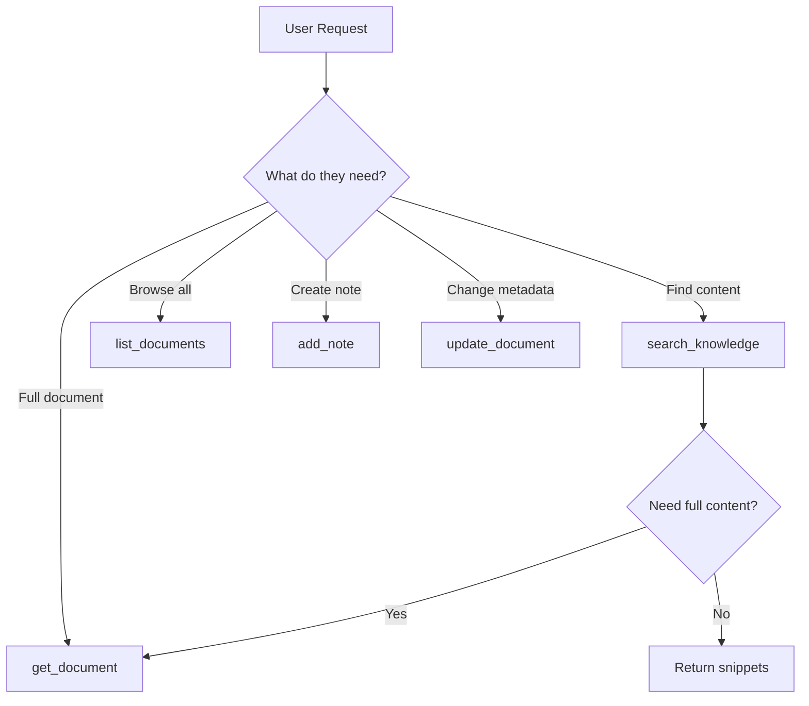

# Textrawl Documentation & Playground Framework

> A visually engaging, agent-friendly documentation and interactive playground for the Textrawl Personal Knowledge MCP Server.

## Executive Summary

This framework outlines the structure for creating modern, interactive documentation that serves both human developers and AI agents. Based on **January 2026** best practices, it combines:

- **Starlight (Astro) v0.37+** for blazing-fast, accessible documentation
- **MCP Playground** leveraging the mature MCP ecosystem (2,000+ servers in registry)
- **Agent-optimized content** with llms.txt, RFC 2119 language, and JSON schemas
- **"Imperfect by Design" aesthetics** with liquid glass effects (2026 trends)
- **AI chatbot integration** and cognitive accessibility features

### Key 2026 Context

- **MCP is now the de-facto standard** - Donated to Linux Foundation's Agentic AI Foundation (Dec 2025)
- **OpenAI officially adopted MCP** (March 2025) - Cross-platform compatibility
- **97M+ monthly SDK downloads** - Massive ecosystem growth
- **WCAG 2.1 AA compliance deadline: April 24, 2026** - Required for U.S. state/local government services (50k+ pop.); strongly recommended for all web applications

### What Makes This Framework Cutting-Edge

This framework goes beyond traditional documentation to embrace **agent-first architecture**:

| Traditional (2024-2025) | Cutting-Edge (2026) |
|-------------------------|---------------------|
| Static docs with examples | Docs auto-update from code changes |
| Manual tool explorer | Natural language request generation |
| llms.txt only | MCP Registry + Schema.org + .well-known/mcp.json |
| CLAUDE.md only | CLAUDE.md + AGENTS.md + Agent Skills |
| Form-based playground | Conversational agentic playground |
| Human-written docs | Agentic documentation workflows |
| Passive tool testing | Agent simulation mode |

---

## Part 0: Agent-First Architecture (Critical for 2026)

### The Paradigm Shift

In January 2026, documentation is no longer just for humans—**61% of searches now begin on AI platforms**. Your docs must be:

1. **Discoverable by agents** without human pointing
2. **Parseable by LLMs** with machine-readable schemas
3. **Maintainable by agents** via agentic documentation workflows
4. **Testable by agents** via agent simulation modes

### Required Files for Agent Discovery

```text
textrawl/
├── CLAUDE.md              # AI coding assistant instructions (existing)
├── AGENTS.md              # NEW: Agent-specific conventions (60k+ projects use this)
├── llms.txt               # AI sitemap (foundation, not sufficient alone)
├── llms-full.txt          # Consolidated docs for single-request ingestion
├── .well-known/
│   └── mcp.json           # NEW: MCP capability advertisement
└── public/
    └── schema.json        # NEW: Schema.org structured data
```

### AGENTS.md (Required - 60,000+ Projects Use This)

```markdown
# AGENTS.md - Agent Conventions for Textrawl

## When Modifying This Codebase
- Run `npm run typecheck` before committing
- Always validate Zod schemas in `src/tools/`
- Use `npm run inspector` to verify MCP tools work
- All logs MUST use `console.error()` (stdout reserved for MCP)

## When Using Textrawl as an MCP Server
- Connect via StreamableHTTPServerTransport (stateless HTTP)
- Bearer token required in production (API_BEARER_TOKEN)
- Rate limits: 100 req/min (API), 10 req/min (uploads)

## Tool Selection Guide
| User Intent | Tool | Key Parameters |
|-------------|------|----------------|
| Find content by meaning | search_knowledge | query, semanticWeight |
| Find exact phrases | search_knowledge | query, fullTextWeight |
| Get full document | get_document | documentId |
| Browse all docs | list_documents | limit, offset, sourceType |
| Add new content | add_note | title, content, tags |
| Update metadata | update_document | documentId, title, tags |

## Error Handling
Errors are returned in result objects (isError: true), NOT as protocol-level errors.
LLM-readable error messages help agents self-correct.

## Testing Pattern
1. Use MCP Inspector: `npm run inspector`
2. Test tool sequence: search → get_document → update_document
3. Verify error messages are agent-readable
```

### .well-known/mcp.json (MCP Capability Advertisement)

```json
{
  "name": "textrawl",
  "version": "1.0.0",
  "description": "Personal Knowledge MCP Server - Hybrid semantic + full-text search",
  "transport": "streamable-http",
  "endpoint": "/mcp",
  "authentication": {
    "type": "bearer",
    "required": true
  },
  "tools": [
    {
      "name": "search_knowledge",
      "description": "Hybrid semantic + full-text search using Reciprocal Rank Fusion",
      "inputSchema": { "$ref": "/api/schema/search_knowledge" }
    },
    {
      "name": "get_document",
      "description": "Retrieve full document content by ID",
      "inputSchema": { "$ref": "/api/schema/get_document" }
    },
    {
      "name": "list_documents",
      "description": "List documents with pagination and filtering",
      "inputSchema": { "$ref": "/api/schema/list_documents" }
    },
    {
      "name": "update_document",
      "description": "Update document title and/or tags",
      "inputSchema": { "$ref": "/api/schema/update_document" }
    },
    {
      "name": "add_note",
      "description": "Create markdown notes with automatic chunking and embedding",
      "inputSchema": { "$ref": "/api/schema/add_note" }
    }
  ],
  "resources": [
    {
      "uri": "textrawl://docs",
      "mimeType": "text/markdown",
      "description": "Complete documentation as MCP resource"
    }
  ],
  "rateLimit": {
    "api": "100/minute",
    "upload": "10/minute"
  }
}
```

### Schema.org Structured Data (public/schema.json)

```json
{
  "@context": "https://schema.org",
  "@type": "SoftwareApplication",
  "name": "Textrawl",
  "description": "Personal Knowledge MCP Server with hybrid semantic + full-text search",
  "applicationCategory": "DeveloperApplication",
  "operatingSystem": "Cross-platform",
  "softwareRequirements": "Node.js >= 22.0.0",
  "offers": {
    "@type": "Offer",
    "price": "0",
    "priceCurrency": "USD"
  },
  "featureList": [
    "Hybrid semantic + full-text search",
    "MCP (Model Context Protocol) integration",
    "OpenAI and Ollama embedding support",
    "PDF, DOCX, MBOX, HTML conversion",
    "Vector embeddings with pgvector"
  ],
  "potentialAction": {
    "@type": "UseAction",
    "target": {
      "@type": "EntryPoint",
      "urlTemplate": "https://textrawl.dev/playground",
      "actionPlatform": ["http://schema.org/DesktopWebPlatform"]
    }
  }
}
```

### MCP Registry Listing (Required for Discovery)

Register at MCP.so and the official registry with:

```yaml
# registry-entry.yaml
name: textrawl
namespace: jeffgreendesign  # Verified via DNS/HTTP challenge
version: 1.0.0
description: Personal Knowledge MCP Server - Turn documents into Claude's memory
capabilities:
  - tools: 5
  - resources: 1
transport: streamable-http
authentication: bearer
repository: https://github.com/jeffgreendesign/textrawl
documentation: https://textrawl.dev/docs
```

### Cursor Rules (`.cursor/rules/` - 2026 Standard)

The modern approach uses **hierarchical `.mdc` files** in `.cursor/rules/`:

```text
.cursor/
├── mcp.json              # MCP server configuration for Cursor
└── rules/
    ├── typescript.mdc    # TypeScript/Node.js conventions
    ├── mcp-tools.mdc     # MCP tool patterns
    ├── database.mdc      # PostgreSQL/embeddings patterns
    ├── security.mdc      # Logging, RLS, environment
    └── documentation.mdc # Markdown formatting standards
```

#### `.cursor/rules/typescript.mdc`
```markdown
---
description: TypeScript and Node.js conventions for Textrawl
globs: ["**/*.ts", "**/*.tsx"]
alwaysApply: false
---

## Type Standards
- No `any` or `unknown` types; use explicit interfaces
- Prefer functions over classes; avoid OOP patterns
- Early returns; handle errors at function start, happy path last
- Descriptive names with auxiliary verbs: `isLoading`, `hasError`

## ESM Module Pattern (CRITICAL)
- All imports MUST use `.js` extensions even for TypeScript files
- Correct: `import { logger } from '../utils/logger.js'`
- Wrong: `import { logger } from '../utils/logger'`

## Node.js Requirements
- Node.js >= 22.0.0 required
- Use ES modules (type: "module" in package.json)
```

#### `.cursor/rules/mcp-tools.mdc`
```markdown
---
description: MCP Server Tool Patterns
globs: ["src/tools/**/*.ts", "src/api/**/*.ts"]
alwaysApply: false
---

## Tool Registration Pattern
Tools registered with `server.tool()` using inline Zod schemas:
\`\`\`typescript
server.tool('tool_name', {
  param: z.string().describe('Description'),
}, async ({ param }) => {
  return { content: [{ type: 'text', text: JSON.stringify(result, null, 2) }] };
});
\`\`\`

## Transport Layer
- Uses StreamableHTTPServerTransport (stateless, serverless-compatible)
- Each request creates fresh server instance (no session persistence)
- HTTP POST `/mcp` endpoint for JSON-RPC

## Error Handling
- Use custom error hierarchy from `src/utils/errors.ts`
- NotFoundError, ValidationError for proper HTTP status codes
- Errors returned in result objects, NOT protocol-level errors
```

#### `.cursor/rules/security.mdc`

```markdown
---
description: Security and Logging Patterns
globs: ["**/*.ts"]
alwaysApply: true
---

## Logging (CRITICAL)
- ALL logs MUST use `console.error()` (stderr)
- NEVER use `console.log()` - stdout reserved for MCP JSON-RPC
- Import logger from `src/utils/logger.ts`

## Rate Limits
- API: 100 req/min
- Upload: 10 req/min

## Environment Variables
Required: SUPABASE_URL, SUPABASE_SERVICE_KEY
Embedding: OPENAI_API_KEY or OLLAMA_BASE_URL + OLLAMA_MODEL
Optional: API_BEARER_TOKEN (required in production, min 32 chars)

## Row Level Security
- RLS enabled with restrictive policies
- App uses service role key (bypasses RLS - intentional single-tenant)
```

#### `.cursor/rules/documentation.mdc`

```markdown
---
description: Markdown and Documentation Formatting Standards
globs: ["**/*.md", "docs/**/*"]
alwaysApply: true
---

## Code Block Language Specifiers (CRITICAL)

ALL fenced code blocks MUST have language specifiers. NEVER omit them.

| Content Type | Specifier |
|--------------|-----------|
| TypeScript/JavaScript | `typescript` or `javascript` |
| JSON | `json` |
| YAML | `yaml` |
| Shell commands | `bash` or `shell` |
| Markdown examples | `markdown` |
| Directory structures | `text` |
| ASCII diagrams | `text` |
| CSS/SCSS | `css` or `scss` |
| SQL | `sql` |
| Mermaid diagrams | `mermaid` |

## Heading Formatting (MD036)

NEVER use emphasis (**text**) as headings. Use proper Markdown headings:

- ❌ Wrong: `**My Heading:**`
- ✅ Correct: `#### My Heading`

Maintain consistent heading hierarchy (h1 → h2 → h3 → h4).

## Other Standards

- Use ATX-style headings (# prefix), not underlines
- One blank line before and after headings
- No trailing punctuation in headings (except ? for questions)
- Tables must have header rows and alignment
- Links should use descriptive text, not raw URLs
```

#### `.cursor/mcp.json`
```json
{
  "mcpServers": {
    "textrawl-dev": {
      "command": "npm",
      "args": ["run", "dev"],
      "env": {
        "PORT": "3000"
      }
    },
    "textrawl-inspector": {
      "command": "npm",
      "args": ["run", "inspector"],
      "env": {
        "MCP_PORT": "5173"
      }
    }
  }
}
```

### Integration: AGENTS.md + CLAUDE.md + Cursor Rules

The 2026 ecosystem has three complementary formats:

| Format | Owner | Consumed By | Purpose |
|--------|-------|-------------|---------|
| **AGENTS.md** | Open Standard (Google/OpenAI/Sourcegraph) | Cursor, Claude Code, Aider, Zed, Factory | Cross-tool agent instructions (60k+ projects) |
| **CLAUDE.md** | Anthropic | Claude Code CLI | Hierarchical system rules, recursive discovery |
| **`.cursor/rules/`** | Cursor | Cursor IDE only | File-scoped, composable IDE rules |

### Recommended Pattern: AGENTS.md as Source of Truth

```text
                    ┌─────────────────┐
                    │   AGENTS.md     │ ← Source of truth (tool-agnostic)
                    │  (project root) │
                    └────────┬────────┘
                             │
              ┌──────────────┴──────────────┐
              ▼                              ▼
     ┌─────────────────┐           ┌─────────────────┐
     │   CLAUDE.md     │           │ .cursor/rules/  │
     │  (references    │           │ (granular IDE   │
     │   AGENTS.md)    │           │  patterns)      │
     └─────────────────┘           └─────────────────┘
              │                              │
              ▼                              ▼
        Claude Code                    Cursor IDE
```

#### Why This Works

- **No duplication**: Single source of truth in AGENTS.md
- **Cursor v1.6+** reads AGENTS.md automatically
- **Claude Code** can reference AGENTS.md from CLAUDE.md
- **Future tools** can consume AGENTS.md standard
- **Backward compatible**: Existing CLAUDE.md rules remain functional

---

## Part 1: Documentation Framework

### Recommended Stack

| Layer | Technology | Why |
|-------|------------|-----|
| **Static Site Generator** | [Starlight v0.37+](https://starlight.astro.build/) (Astro) | Fastest performance, Island Architecture, <50KB first load, built-in dark mode + search |
| **API Reference** | [Scalar](https://scalar.com/) or [Mintlify](https://mintlify.com/) | OpenAPI integration, interactive explorer, modern UI |
| **Diagrams** | [Mermaid](https://mermaid.js.org/) + AI-assisted tools (Lucidchart, Miro) | Git version-controllable + AI auto-generation |
| **Code Playground** | [Sandpack 2.0](https://sandpack.codesandbox.io/) with Nodebox | Works in Safari/iOS, universal browser support |
| **MCP Playground** | [Cloudflare Workers AI Playground](https://blog.cloudflare.com/remote-model-context-protocol-servers-mcp/) or [Plugged.in](https://plugged.in/) | Purpose-built for MCP servers, remote testing |
| **Hosting** | Vercel, Netlify, or Cloudflare Pages | Fast CDN, free tier, automatic deploys |

### Alternative Stacks

**Option B: Mintlify (SaaS) - Recommended for API-first**
- Pros: Used by Cursor, Perplexity, Coinbase, Anthropic; beautiful defaults; AI-assisted writing
- Cons: ~$300/month Pro tier, managed platform
- Best for: Teams wanting premium aesthetics with minimal setup

**Option C: Docusaurus (React)**
- Pros: Mature ecosystem (61,800+ GitHub stars), proven at scale
- Cons: Higher JavaScript overhead (SPA architecture)
- Best for: Large projects with React expertise

**Note:** GitBook underwent major pricing restructure in 2025 (2-3x increase), causing many teams to migrate to alternatives.

---

## Part 2: Site Structure

```text
docs.textrawl.dev/
├── / (Landing page with hero + features)
├── /getting-started/
│   ├── quick-start (5-minute setup)
│   ├── installation
│   ├── configuration
│   └── first-search (tutorial)
├── /mcp-tools/
│   ├── overview (tool selection guide)
│   ├── search-knowledge
│   ├── get-document
│   ├── list-documents
│   ├── update-document
│   └── add-note
├── /api-reference/
│   ├── authentication
│   ├── upload-endpoint
│   ├── health-endpoints
│   └── error-codes
├── /cli/
│   ├── overview
│   ├── mbox-conversion
│   ├── html-conversion
│   ├── takeout-import
│   ├── batch-upload
│   └── recipes (common patterns)
├── /web-ui/
│   ├── features
│   ├── drag-and-drop
│   └── auto-upload
├── /guides/
│   ├── email-import (Gmail walkthrough)
│   ├── pdf-knowledge-base
│   ├── search-optimization
│   └── deployment/
│       ├── docker
│       ├── cloud-run
│       └── security-hardening
├── /architecture/
│   ├── how-hybrid-search-works
│   ├── chunking-strategy
│   ├── embedding-providers
│   └── mcp-transport
├── /playground/ (Interactive demo)
├── /troubleshooting/
└── /changelog/
```

---

## Part 3: Agent-Native MCP Playground (Cutting-Edge 2026)

> **Key Shift:** The cutting-edge playground in 2026 is not a tool explorer—it's an **agentic environment** where the playground itself becomes an agent that helps developers understand and use your MCP server.

### Two-Mode Architecture

```text
┌──────────────────────────────────────────────────────────────────────┐
│                    Textrawl MCP Playground                            │
├────────────────────────────────────┬─────────────────────────────────┤
│  [💬 Conversational] [🔧 Classic]  │  [Agent Simulation] [Workflows] │
├────────────────────────────────────┴─────────────────────────────────┤
│                                                                      │
│  ┌────────────────────────────────────────────────────────────────┐  │
│  │ 💬 What would you like to do?                                   │  │
│  │                                                                 │  │
│  │ > Find all my notes about Q4 revenue that mention customers    │  │
│  │                                                                 │  │
│  │ ┌─────────────────────────────────────────────────────────────┐│  │
│  │ │ I'll use search_knowledge with hybrid search:               ││  │
│  │ │ • Query: "Q4 revenue customers"                             ││  │
│  │ │ • Semantic weight: 0.6 (meaning-based)                      ││  │
│  │ │ • Full-text weight: 0.8 (exact phrases)                     ││  │
│  │ │                                                             ││  │
│  │ │ [Execute] [Edit Parameters] [Show JSON]                     ││  │
│  │ └─────────────────────────────────────────────────────────────┘│  │
│  │                                                                 │  │
│  │ 📄 Results (3 documents found):                                │  │
│  │ ├─ Q4 Planning Document (score: 0.89)                          │  │
│  │ ├─ Customer Revenue Analysis (score: 0.76)                     │  │
│  │ └─ Budget Meeting Notes (score: 0.71)                          │  │
│  │                                                                 │  │
│  │ 💡 Suggested next steps:                                       │  │
│  │ • "Get the full Q4 Planning Document"                          │  │
│  │ • "Search for similar documents"                               │  │
│  │ • "Tag these as Q4-related"                                    │  │
│  └────────────────────────────────────────────────────────────────┘  │
│                                                                      │
│  ┌────────────────────────────────────────────────────────────────┐  │
│  │ 📝 Session Memory (3 queries)  [Export as Markdown] [Clear]    │  │
│  └────────────────────────────────────────────────────────────────┘  │
└──────────────────────────────────────────────────────────────────────┘
```

### Cutting-Edge Features (2026)

#### 1. Natural Language Request Generation

Users describe intent in plain English → playground generates optimal MCP calls:

```text
User: "Find emails from October about the project budget"

Playground generates:
→ search_knowledge({
    query: "project budget",
    sourceType: "email",
    semanticWeight: 0.8,
    fullTextWeight: 1.0
  })

  Filters applied: sourceType="email", date context inferred
```

#### 2. Conversational Context (Persistent Memory)

- Single conversation thread, not isolated tool calls
- "I searched for X, now show me similar documents" (remembers context)
- Smart memories about user's search patterns
- Session persists across page reloads

#### 3. Agent Simulation Mode

Simulate how Claude Code would use your MCP server:

```text
┌─────────────────────────────────────────────────────────────────┐
│ 🤖 Agent Simulation: Research Assistant                         │
├─────────────────────────────────────────────────────────────────┤
│                                                                 │
│ Task: "Find and summarize all Q4 planning documents"            │
│                                                                 │
│ Step 1: search_knowledge("Q4 planning", limit: 10)              │
│ └─ Found 5 documents                                            │
│                                                                 │
│ Step 2: get_document("doc-123") → Q4 Planning v2.md             │
│ └─ Retrieved 2,048 tokens                                       │
│                                                                 │
│ Step 3: get_document("doc-456") → Budget Allocation.md          │
│ └─ Retrieved 1,536 tokens                                       │
│                                                                 │
│ Agent Decision: Sufficient context gathered                     │
│ Total tokens: 3,584 | Tools called: 3 | Time: 847ms            │
│                                                                 │
│ [Replay] [Edit Task] [Export Workflow]                          │
└─────────────────────────────────────────────────────────────────┘
```

#### 4. Visual Workflow Builder

Drag-and-drop multi-tool sequences:

```text
┌──────────────┐     ┌───────────────┐     ┌─────────────────┐
│ search_      │────▶│ get_document  │────▶│ update_document │
│ knowledge    │     │               │     │                 │
│              │     │ (for each     │     │ (add tags)      │
│ query: "..."│     │  result)      │     │                 │
└──────────────┘     └───────────────┘     └─────────────────┘

[Run Workflow] [Generate Code] [Save as Template]
```

#### 5. Live SDK Code Generation

As users explore, show generated code in real-time:

```typescript
// Generated TypeScript - Copy to your project
import { MCPClient } from '@modelcontextprotocol/sdk';

const client = new MCPClient({
  transport: 'streamable-http',
  endpoint: 'https://your-textrawl-instance/mcp',
  auth: { type: 'bearer', token: process.env.TEXTRAWL_TOKEN }
});

// Your exploration session:
const results = await client.callTool('search_knowledge', {
  query: 'Q4 revenue customers',
  semanticWeight: 0.6,
  fullTextWeight: 0.8,
  limit: 10
});

// Next step (suggested by playground):
const doc = await client.callTool('get_document', {
  documentId: results.content[0].id,
  includeChunks: true
});
```

#### 6. Context-Aware Adaptive Examples

Examples adapt based on user's journey:
- User searches documents → show `get_document` patterns
- User tags documents → show `update_document` examples
- User adds notes → show chunking/embedding behavior
- "Based on your queries, try combining search + tagging"

#### 7. Markdown Export with Session Memory

Export entire session as reproducible documentation:

```markdown
# Research Session: Q4 Analysis
Exported: 2026-01-03T14:32:00Z

## Query 1: Find revenue mentions
```json
{ "tool": "search_knowledge", "args": { "query": "Q4 revenue" } }
```
Results: 3 documents found

## Query 2: Get full document
```json
{ "tool": "get_document", "args": { "documentId": "doc-123" } }
```

## Generated Integration Code
[TypeScript code block]

## Agent Simulation Log
[Decision chain and token usage]
```

### Classic Mode (Fallback)

For users who prefer traditional form-based exploration:

1. **Tool Selector Panel** - Radio buttons for 5 MCP tools
2. **Dynamic Form Builder** - Auto-generates UI from Zod schemas
3. **Request Preview** - View JSON, Copy as cURL, Copy for Claude
4. **Response Visualization** - Syntax-highlighted JSON with stats
5. **Demo Mode** - Pre-populated sample data for first-time users

### Implementation Options

**Option A: Cloudflare Workers MCP Playground (Recommended for 2026)**
- Use Cloudflare's remote MCP client infrastructure
- Built-in auth support, no local installation required
- Online chat interface for instant testing
- Leverage the MCP ecosystem's maturity

**Option B: Embedded in Docs**

```text
/docs/playground/           → Full playground page
/docs/mcp-tools/search     → Embedded mini-playground per tool
```

**Option C: Plugged.in Integration**
- Comprehensive proxy combining multiple MCP servers
- Built-in playground for debugging
- Discovery and management of tools, prompts, resources

**Option D: Custom Standalone App**
- Separate subdomain: `playground.textrawl.dev`
- React SPA with Vite
- Two-panel layout (Stripe standard): explanations left, code right

### Technology Stack for Custom Playground

```text
// Stack
Framework: React 18 + TypeScript
Build: Vite
Styling: Tailwind CSS + shadcn/ui components
State: React Query (for API calls)
Forms: React Hook Form + Zod validation
Diagrams: Mermaid (embedded)
Code Display: Shiki (syntax highlighting)

// Key Dependencies
"@tanstack/react-query": "^5.x"
"react-hook-form": "^7.x"
"zod": "^3.x"
"shiki": "^1.x"
"mermaid": "^10.x"
```

---

## Part 4: Agent-Friendly Documentation

### 2026 Reality Check: llms.txt Adoption

**Current state (as of Jan 2026):**
- Only ~784 websites (0.3% of top 1,000) have implemented llms.txt
- Major AI companies have NOT officially committed to using llms.txt files
- Google explicitly rejected it (Gary Illyes, July 2025)

**However, still implement it because:**
- Google included llms.txt in their A2A (Agents to Agents) protocol
- Foundation for future standards evolution
- Good content curation practice regardless of AI adoption
- MCP ecosystem benefits from structured discovery

### Files to Create

#### 1. `/llms.txt` - AI Sitemap
```markdown
# Textrawl - Personal Knowledge MCP Server
> Hybrid semantic + full-text search over documents for Claude

## MCP Server Capabilities
- Protocol: Model Context Protocol (MCP) via StreamableHTTPServerTransport
- Transport: Stateless HTTP (serverless-compatible)
- Authentication: Bearer token (API_BEARER_TOKEN)

## Tools (RFC 2119 Language)
- search_knowledge: MUST provide query; MAY specify weights, tags, limits
- get_document: MUST provide documentId; MAY request chunks
- list_documents: MAY filter by sourceType, tags; SHOULD paginate
- update_document: MUST provide documentId; MAY update title, tags
- add_note: MUST provide title, content; MAY add tags

## Documentation
- /README.md: Overview, features, quick start
- /CLAUDE.md: AI coding assistant instructions (RECOMMENDED for agents)
- /docs/CLI.md: Command-line tools
- /docs/SECURITY.md: Row Level Security
- /docs/MCP-TOOLS.md: Complete MCP tool reference with JSON schemas
- /api/schema: Machine-readable tool definitions (JSON)

## Quick Facts
- 5 MCP tools available
- Embedding providers: OpenAI (1536 dim) or Ollama (1024 dim)
- Database: Supabase PostgreSQL with pgvector
- Rate limits: API 100/min, Upload 10/min
- Node.js requirement: >= 22.0.0
```

#### 2. `/llms-full.txt` - Consolidated Docs
Single file containing all documentation concatenated for single-request AI ingestion.

#### 3. `/api/schema` - Machine-Readable Tool Definitions
Expose JSON schemas at runtime for dynamic agent discovery.

#### 3. Enhanced `/CLAUDE.md` Additions

```markdown
## Quick Reference Values

| Metric | Value |
|--------|-------|
| Max chunk size | 512 tokens (~2048 chars) |
| Chunk overlap | 50 tokens |
| OpenAI embeddings | 1536 dimensions |
| Ollama embeddings | 1024 dimensions |
| API rate limit | 100 req/min |
| Upload rate limit | 10 req/min |
| Node.js version | >= 22.0.0 |

## Tool Selection Guide



## Common Agent Patterns

### Pattern 1: Search and Retrieve
1. Call `search_knowledge` with user's query
2. If user wants details, call `get_document` for top result
3. Summarize content for user

### Pattern 2: Knowledge Capture
1. Call `add_note` with user's content
2. Return document ID for reference
3. Optionally search to verify indexing

### What NOT to Do
- ❌ `search_knowledge` with empty query (rejected)
- ❌ `limit > 50` (max is 50)
- ❌ Both weights at 0 (no results possible)
- ❌ `update_document` on immutable fields (source_type, created_at)
```

#### 4. `/docs/MCP-TOOLS.md` - Complete Tool Reference

Structure for each tool:
```markdown
## search_knowledge

### Purpose
Hybrid semantic + full-text search using Reciprocal Rank Fusion.

### When to Use
- Finding documents by meaning ("emails about project risks")
- Finding exact phrases ("Q3 financial targets")
- Combining both ("reviews of the new proposal")

### Parameters

| Name | Type | Required | Default | Description |
|------|------|----------|---------|-------------|
| query | string | ✅ | - | Search query (non-empty) |
| limit | number | | 10 | Max results (1-50) |
| fullTextWeight | number | | 1.0 | Keyword match weight (0-2) |
| semanticWeight | number | | 1.0 | Meaning match weight (0-2) |
| tags | string[] | | - | Filter by tags |
| sourceType | string | | - | Filter: "file", "note", "email" |
| minScore | number | | 0 | Minimum relevance threshold |

### JSON Schema
```json
{
  "type": "object",
  "properties": {
    "query": { "type": "string", "minLength": 1 },
    "limit": { "type": "number", "minimum": 1, "maximum": 50, "default": 10 },
    "fullTextWeight": { "type": "number", "minimum": 0, "maximum": 2 },
    "semanticWeight": { "type": "number", "minimum": 0, "maximum": 2 }
  },
  "required": ["query"]
}
```

### Example Request
```json
{
  "jsonrpc": "2.0",
  "method": "tools/call",
  "params": {
    "name": "search_knowledge",
    "arguments": {
      "query": "project timeline Q4",
      "limit": 5,
      "semanticWeight": 1.2
    }
  }
}
```

### Example Response
```json
{
  "results": [
    {
      "id": "550e8400-e29b-41d4-a716-446655440000",
      "title": "Q4 Planning Document",
      "score": 0.89,
      "snippet": "The Q4 project timeline begins in October..."
    }
  ],
  "total": 12
}
```

### Error Scenarios

| Error | Cause | Resolution |
|-------|-------|------------|
| ValidationError | Empty query | Provide non-empty query string |
| ValidationError | limit > 50 | Reduce limit to 50 or less |
| RateLimitError | >100 req/min | Implement exponential backoff |
```

---

## Part 5: Visual Design System

### 2026 Design Trends

**"Imperfect by Design"** - 2026 is the year of human-centered aesthetics:
- Moving away from sterile corporate perfection
- Embracing organic, personal visual tones
- Custom illustrations over generic icons

**Key Visual Patterns:**
- **Liquid Glass / Glassmorphism** - Translucent overlays, frosted backgrounds
- **Monospaced Typography** - Beyond code blocks, into headings and UI
- **Two-Panel Layout** (Stripe standard) - Explanations left, code right
- **AI Chatbot Integration** - Embedded assistants in docs (Docker, Netlify pattern)
- **Cognitive Accessibility** - Design for ADHD, autism, dyslexia

### Color Palette (Dark Mode Default)

```css
/* Based on 2026 trends: liquid glass + subtle gradients */

:root {
  /* Backgrounds - Use dark grays, not pure black */
  --bg-primary: #0a0a0f;      /* Main background */
  --bg-secondary: #12121a;    /* Cards, sidebars */
  --bg-tertiary: #1a1a24;     /* Elevated surfaces */

  /* Text - Soften white for readability */
  --text-primary: #e4e4e7;    /* Main text */
  --text-secondary: #a1a1aa;  /* Muted text */
  --text-muted: #71717a;      /* Very subtle */

  /* Accent - Neon blue/purple gradient */
  --accent-primary: #6366f1;  /* Indigo */
  --accent-secondary: #8b5cf6; /* Violet */
  --accent-glow: rgba(99, 102, 241, 0.2);

  /* Semantic */
  --success: #22c55e;
  --warning: #f59e0b;
  --error: #ef4444;
  --info: #3b82f6;

  /* Code blocks */
  --code-bg: #1e1e2e;
  --code-border: #313244;
}

/* Light mode (toggle available) */
[data-theme="light"] {
  --bg-primary: #ffffff;
  --bg-secondary: #f4f4f5;
  --bg-tertiary: #e4e4e7;
  --text-primary: #18181b;
  --text-secondary: #52525b;
}
```

### Typography

```css
/* Modern, readable font stack */
--font-sans: 'Inter', -apple-system, BlinkMacSystemFont, 'Segoe UI', sans-serif;
--font-mono: 'JetBrains Mono', 'Fira Code', 'Consolas', monospace;

/* Scale */
--text-xs: 0.75rem;   /* 12px */
--text-sm: 0.875rem;  /* 14px */
--text-base: 1rem;    /* 16px */
--text-lg: 1.125rem;  /* 18px */
--text-xl: 1.25rem;   /* 20px */
--text-2xl: 1.5rem;   /* 24px */
--text-3xl: 1.875rem; /* 30px */
```

### Layout: Sticky Sidebar + Main Content

```text
┌──────────────────────────────────────────────────────────────────┐
│  [Logo]  Textrawl Docs                    [Search]  [Theme] [GH] │
├────────────────┬─────────────────────────────────────────────────┤
│                │                                                 │
│  Getting       │   # search_knowledge                            │
│  Started       │                                                 │
│    Quick Start │   Hybrid semantic + full-text search using      │
│    Install     │   Reciprocal Rank Fusion (RRF) to combine       │
│    Config      │   results from both search methods.             │
│                │                                                 │
│  MCP Tools ▼   │   ┌─────────────────────────────────────────┐   │
│    search_*    │   │ 💡 Try it in the playground              │   │
│    get_doc     │   │    [Open Playground →]                  │   │
│    list_docs   │   └─────────────────────────────────────────┘   │
│    update_doc  │                                                 │
│    add_note    │   ## Parameters                                 │
│                │                                                 │
│  API Reference │   | Name | Type | Required | Default |          │
│                │   |------|------|----------|---------|          │
│  CLI           │   | query | string | ✅ | - |                   │
│                │   | limit | number | | 10 |                     │
│  Guides        │                                                 │
│                │   ## Example                                    │
│  [Playground]  │                                                 │
│                │   ```json                                       │
└────────────────┴─────────────────────────────────────────────────┘
```

### Microinteractions

1. **Code Block Copy Button**
   - Hover: Button fades in (opacity 0 → 1)
   - Click: Icon changes to checkmark, "Copied!" tooltip
   - 2s later: Returns to copy icon

2. **Navigation Links**
   - Hover: Subtle background color + left border accent
   - Active: Filled left border + bold text

3. **Collapsible Sections**
   - Click: Smooth height animation (300ms ease)
   - Chevron rotates 90°

4. **Search**
   - `/` keyboard shortcut opens modal
   - Debounced search (300ms)
   - Results highlight matching terms

5. **Playground**
   - Submit: Button shows loading spinner
   - Success: Response panel slides in
   - Error: Red border + shake animation

### Diagram Style (Mermaid)

```javascript
// mermaid.config.js
{
  theme: 'dark',
  themeVariables: {
    primaryColor: '#6366f1',
    primaryTextColor: '#e4e4e7',
    primaryBorderColor: '#6366f1',
    lineColor: '#a1a1aa',
    secondaryColor: '#1a1a24',
    tertiaryColor: '#12121a',
    background: '#0a0a0f',
    mainBkg: '#12121a',
    nodeBorder: '#6366f1',
    clusterBkg: '#1a1a24',
    clusterBorder: '#313244',
    titleColor: '#e4e4e7',
    edgeLabelBackground: '#12121a'
  }
}
```

---

## Part 5.5: Agentic Documentation Workflows (2026 Standard)

### The Shift: Docs Maintained by Agents

In 2026, documentation is no longer a static artifact—it's a **living system maintained by multi-agent workflows**:

```text
┌──────────────────────────────────────────────────────────────────────┐
│                   Agentic Documentation Pipeline                      │
├──────────────────────────────────────────────────────────────────────┤
│                                                                      │
│  ┌─────────────┐    ┌─────────────┐    ┌─────────────┐              │
│  │   Code      │    │   Writing   │    │   Review    │              │
│  │   Change    │───▶│   Agent     │───▶│   Agent     │              │
│  │             │    │             │    │             │              │
│  │ src/tools/  │    │ Generates   │    │ Validates   │              │
│  │ *.ts        │    │ doc updates │    │ accuracy    │              │
│  └─────────────┘    └─────────────┘    └──────┬──────┘              │
│                                               │                      │
│                     ┌─────────────────────────┴──────────────┐      │
│                     ▼                                        ▼      │
│              ┌─────────────┐                          ┌───────────┐ │
│              │   Example   │                          │   Human   │ │
│              │ Validation  │                          │   Review  │ │
│              │   Agent     │                          │ (optional)│ │
│              │             │                          │           │ │
│              │ Tests code  │                          │ PR merge  │ │
│              │ examples    │                          │ approval  │ │
│              └─────────────┘                          └───────────┘ │
│                                                                      │
└──────────────────────────────────────────────────────────────────────┘
```

### Auto-Sync Documentation from Code

**GitHub Actions Workflow:**

```yaml
# .github/workflows/docs-sync.yml
name: Sync Documentation from Code

on:
  push:
    paths:
      - 'src/tools/**/*.ts'
      - 'src/types/**/*.ts'

jobs:
  sync-docs:
    runs-on: ubuntu-latest
    steps:
      - uses: actions/checkout@v4

      - name: Extract Zod Schemas
        run: npm run generate:schemas

      - name: Generate Tool Documentation
        run: npm run generate:tool-docs

      - name: Validate Examples
        run: npm run test:doc-examples

      - name: Create PR if changes
        uses: peter-evans/create-pull-request@v6
        with:
          title: "docs: auto-sync from code changes"
          body: "Automated documentation update from Zod schema changes"
```

**Schema-to-Docs Generator:**

```typescript
// scripts/generate-tool-docs.ts
import { z } from 'zod';
import { searchKnowledgeSchema } from '../src/tools/search.js';

function generateToolDoc(name: string, schema: z.ZodObject<any>) {
  const shape = schema.shape;
  let doc = `## ${name}\n\n`;

  for (const [key, value] of Object.entries(shape)) {
    const zodValue = value as z.ZodTypeAny;
    doc += `### ${key}\n`;
    doc += `- Type: ${zodValue._def.typeName}\n`;
    doc += `- Description: ${zodValue.description || 'No description'}\n`;
    doc += `- Required: ${!zodValue.isOptional()}\n\n`;
  }

  return doc;
}
```

### Embedded Docs Agent (Table Stakes in 2026)

An AI assistant embedded in your docs that can:

```text
┌────────────────────────────────────────────────────────────────┐
│ 🤖 Textrawl Docs Assistant                              [x]   │
├────────────────────────────────────────────────────────────────┤
│                                                                │
│ 💬 How can I help you with Textrawl?                           │
│                                                                │
│ User: How do I import my Gmail inbox?                          │
│                                                                │
│ Assistant: Here's how to import Gmail:                         │
│                                                                │
│ 1. Export from Google Takeout (select Gmail, MBOX format)      │
│ 2. Run: npm run convert -- mbox ~/path/to/All\ mail.mbox       │
│ 3. Upload: npm run upload -- ./converted-emails/               │
│                                                                │
│ Would you like me to:                                          │
│ • [Test your MCP connection]                                   │
│ • [Generate the full command for your setup]                   │
│ • [Show related troubleshooting tips]                          │
│                                                                │
│ ─────────────────────────────────────────────────────────────  │
│ Type your question...                              [Send]     │
└────────────────────────────────────────────────────────────────┘
```

The docs agent uses Textrawl's own MCP server to search documentation:

```typescript
// Docs agent uses Textrawl to search its own docs
const docsAgent = new MCPClient({
  endpoint: '/mcp',
  tools: ['search_knowledge', 'get_document']
});

async function answerQuestion(question: string) {
  // Search docs using Textrawl itself
  const results = await docsAgent.callTool('search_knowledge', {
    query: question,
    sourceType: 'documentation',
    limit: 5
  });

  // Retrieve relevant docs
  const context = await Promise.all(
    results.map(r => docsAgent.callTool('get_document', { documentId: r.id }))
  );

  // Generate answer using Claude
  return await claude.generate({
    system: 'You are a Textrawl documentation assistant.',
    context: context.map(d => d.content).join('\n\n'),
    question
  });
}
```

---

## Part 6: Implementation Roadmap (Updated for 2026)

### Phase 1: Agent-First Foundation (Week 1-2)

#### Agent Discovery Files (CRITICAL)

- [ ] Create `AGENTS.md` with agent conventions (source of truth)
- [ ] Create `.well-known/mcp.json` for MCP discovery
- [ ] Add Schema.org JSON-LD structured data
- [ ] Register in MCP Registry (mcp.so)

#### Cursor Rules Setup

- [ ] Create `.cursor/rules/typescript.mdc` - TypeScript/ESM conventions
- [ ] Create `.cursor/rules/mcp-tools.mdc` - Tool registration patterns
- [ ] Create `.cursor/rules/database.mdc` - Embeddings/chunking patterns
- [ ] Create `.cursor/rules/security.mdc` - Logging/RLS patterns
- [ ] Create `.cursor/mcp.json` - MCP server configuration for Cursor

#### Update Existing Agent Files

- [ ] Enhance `/CLAUDE.md` with tool selection guide + AGENTS.md reference
- [ ] Add JSON schemas at `/api/schema`

#### Documentation Site Setup

- [ ] Initialize Starlight project
- [ ] Configure dark mode theme with color palette
- [ ] Set up Mermaid integration
- [ ] Deploy to Vercel/Netlify

#### Agent-Friendly Content

- [ ] Create `/llms.txt` and `/llms-full.txt`
- [ ] Create `/docs/MCP-TOOLS.md` with RFC 2119 language

### Phase 2: Core Content + Auto-Sync (Week 3-4)

#### Getting Started

- [ ] 5-minute quick start with video walkthrough
- [ ] Step-by-step Supabase setup (interactive)
- [ ] Claude Desktop configuration (Desktop Extension .mcpb)

#### MCP Tools Documentation

- [ ] Document all 5 tools with LLM-readable descriptions
- [ ] Add tool selection flowchart (Mermaid)
- [ ] Write agent patterns guide

#### Auto-Sync Pipeline

- [ ] GitHub Actions for schema-to-docs generation
- [ ] Example validation tests
- [ ] Changelog automation

### Phase 3: Agent-Native Playground (Week 5-6)

- [ ] Conversational interface with natural language input
- [ ] Agent simulation mode
- [ ] Visual workflow builder
- [ ] Live SDK code generation
- [ ] Session memory with markdown export
- [ ] Classic mode fallback

### Phase 4: Embedded Docs Agent (Week 7-8)

- [ ] Build docs agent using Textrawl's own MCP server
- [ ] Implement guided troubleshooting
- [ ] Add "Test your connection" interactive flow
- [ ] Deploy as embedded widget

#### Visual Polish

- [ ] Custom illustrations (hand-drawn "Imperfect by Design" style)
- [ ] Microinteraction animations
- [ ] Mobile responsive testing
- [ ] Accessibility audit (WCAG AA)

#### Additional Content

- [ ] API Reference (REST endpoints)
- [ ] Web UI guide with screenshots
- [ ] Architecture deep dive
- [ ] Deployment guides (Docker, Cloud Run)
- [ ] Troubleshooting FAQ

### Phase 5: Launch & Iterate

- [ ] Create `/llms-full.txt` consolidated doc
- [ ] Add changelog page
- [ ] Set up analytics (Plausible/Fathom)
- [ ] Community feedback collection
- [ ] Iterate based on usage patterns

---

## Part 7: Technical Specifications

### Starlight Configuration

```javascript
// astro.config.mjs
import { defineConfig } from 'astro/config';
import starlight from '@astrojs/starlight';

export default defineConfig({
  integrations: [
    starlight({
      title: 'Textrawl',
      description: 'Personal Knowledge MCP Server - Turn documents into Claude\'s memory',
      logo: { src: './src/assets/logo.svg' },
      social: {
        github: 'https://github.com/your-org/textrawl',
      },
      editLink: {
        baseUrl: 'https://github.com/your-org/textrawl/edit/main/docs/',
      },
      customCss: ['./src/styles/custom.css'],
      sidebar: [
        { label: 'Getting Started', autogenerate: { directory: 'getting-started' } },
        { label: 'MCP Tools', autogenerate: { directory: 'mcp-tools' } },
        { label: 'API Reference', autogenerate: { directory: 'api-reference' } },
        { label: 'CLI', autogenerate: { directory: 'cli' } },
        { label: 'Guides', autogenerate: { directory: 'guides' } },
        { label: 'Architecture', autogenerate: { directory: 'architecture' } },
        { label: 'Playground', link: '/playground/' },
      ],
      components: {
        // Override components for custom styling
        Head: './src/components/Head.astro',
      },
      head: [
        // llms.txt meta link
        { tag: 'link', attrs: { rel: 'llms', href: '/llms.txt' } },
        // JSON-LD structured data
        { tag: 'script', attrs: { type: 'application/ld+json' }, content: '...' },
      ],
    }),
  ],
});
```

### Playground Component Structure

```text
src/components/Playground/
├── index.tsx              // Main playground component
├── ToolSelector.tsx       // Tool selection panel
├── FormBuilder.tsx        // Dynamic form from Zod schema
├── RequestPreview.tsx     // JSON/cURL preview
├── ResponseViewer.tsx     // Syntax-highlighted response
├── DemoData.ts            // Sample queries and responses
├── schemas/               // Zod schemas for each tool
│   ├── searchKnowledge.ts
│   ├── getDocument.ts
│   ├── listDocuments.ts
│   ├── updateDocument.ts
│   └── addNote.ts
└── hooks/
    ├── useMcpCall.ts      // React Query hook for MCP calls
    └── useFormSchema.ts   // Dynamic form generation
```

### API for Playground Demo

```typescript
// Demo endpoint for playground (optional - can use main server)
// /api/playground/demo

export async function POST(req: Request) {
  const { tool, args } = await req.json();

  // Return mock data for demo mode
  if (isDemoMode(req)) {
    return Response.json(DEMO_RESPONSES[tool]);
  }

  // Forward to real MCP endpoint
  return fetch(`${TEXTRAWL_URL}/mcp`, {
    method: 'POST',
    headers: {
      'Content-Type': 'application/json',
      'Authorization': req.headers.get('Authorization'),
    },
    body: JSON.stringify({
      jsonrpc: '2.0',
      method: 'tools/call',
      params: { name: tool, arguments: args },
    }),
  });
}
```

---

## Part 8: Success Metrics

### Documentation Quality

| Metric | Target | How to Measure |
|--------|--------|----------------|
| Time to first search | < 10 minutes | User testing, analytics |
| Page load speed | < 1.5s | Lighthouse |
| Accessibility score | 95+ | Lighthouse, axe |
| Search success rate | > 80% | In-docs search analytics |

### Playground Engagement

| Metric | Target | How to Measure |
|--------|--------|----------------|
| Playground visits | 30% of doc visitors | Analytics |
| Queries executed | > 3 per session | Event tracking |
| Demo → real server | 20% conversion | User accounts/API usage |

### Agent Adoption

| Metric | Target | How to Measure |
|--------|--------|----------------|
| llms.txt fetches | Growing | Server logs |
| AI referral traffic | 15% by EOY 2026 | Analytics (referrer: ChatGPT, Claude, Perplexity) |
| MCP Registry listing | Listed + discoverable | MCP.so, official registry |
| Claude Desktop installs | Track via MCP inspector | Community survey |

---

## Appendix A: Competitor Documentation Analysis (2026)

| Site | Strengths | Adopt for Textrawl |
|------|-----------|-------------------|
| **Stripe** | Two-panel layout, Stripe Shell (browser-based testing), governance-driven | Two-panel layout, interactive playground |
| **Docker** | Night/Day mode, AI chatbot, Recap & Cheat Sheet sections | AI chatbot integration |
| **Netlify** | Minimal sleek design, video tutorials, AI chatbot | Video tutorials alongside written docs |
| **Plaid** | Pragmatic, clean design for quick navigation | Fast navigation patterns |
| **Render** | Colorful homepage, Quickstarts for multiple languages | Language-specific quickstarts |
| **OpenAI** | API Playground with View Code, Anthropic's similar feature | View Code button for all examples |

---

## Appendix B: Accessibility Checklist (WCAG 2.2 + April 2026 Deadline)

**Critical for Compliance:**
- [ ] Color contrast: 4.5:1 for text, 3:1 for UI elements (WCAG 2.1 AA)
- [ ] Focus indicators visible and clear (WCAG 2.2 emphasis)
- [ ] Touch targets: minimum 48x48px (WCAG 2.2)
- [ ] Keyboard navigation for all interactions
- [ ] `prefers-reduced-motion` support (MANDATORY)

**Standard Requirements:**
- [ ] All images have alt text
- [ ] Screen reader tested (VoiceOver, NVDA)
- [ ] Form labels and error messages
- [ ] Skip-to-content link
- [ ] Semantic HTML (headings, landmarks)
- [ ] ARIA labels where needed

**Cognitive Accessibility (2026 Focus):**
- [ ] Clear information hierarchy
- [ ] Minimal notification fatigue
- [ ] Optional minimalist/reduced-distraction mode
- [ ] Focus drift prevention for ADHD users
- [ ] Clear, simple language (benefits ESL users too)

**Legal Note:** U.S. compliance deadline for WCAG 2.1 Level AA is **April 24, 2026** for state/local government digital services (pop. 50k+).

---

## Appendix C: Resources (Updated 2026)

### Documentation Frameworks
- [Starlight Docs v0.37+](https://starlight.astro.build/)
- [Docusaurus](https://docusaurus.io/)
- [Mintlify](https://mintlify.com/) - Used by Anthropic, Cursor, Perplexity

### MCP Ecosystem
- [MCP Official Specification (Nov 2025)](https://modelcontextprotocol.io/specification/2025-11-25)
- [MCP Registry](https://mcp.so/) - 2,000+ servers
- [Cloudflare Workers AI MCP](https://blog.cloudflare.com/remote-model-context-protocol-servers-mcp/)
- [Plugged.in MCP Proxy](https://plugged.in/)
- [Agentic AI Foundation (Linux Foundation)](https://www.anthropic.com/news/donating-the-model-context-protocol-and-establishing-of-the-agentic-ai-foundation)

### Design Inspiration
- [Stripe API Reference](https://docs.stripe.com/api) - Two-panel gold standard
- [Docker Docs](https://docs.docker.com/) - AI chatbot integration
- [OpenAI Platform](https://platform.openai.com/docs) - Playground with View Code

### Agent-Friendly Standards
- [llms.txt Specification](https://llmstxt.org/) - Evolving standard
- [MCP Best Practices](https://modelcontextprotocol.io/docs/best-practices/)
- [OpenAI Practical Guide to Building Agents](https://cdn.openai.com/business-guides-and-resources/a-practical-guide-to-building-agents.pdf)

### Tools
- [Mermaid Live Editor](https://mermaid.live/)
- [Sandpack 2.0](https://sandpack.codesandbox.io/)
- [Scalar API Reference](https://scalar.com/)
- [WebAIM Contrast Checker](https://webaim.org/resources/contrastchecker/)
- [Lucidchart](https://www.lucidchart.com/) - AI-assisted diagramming
- [Miro](https://miro.com/) - AI-powered system design

---

## Appendix D: Sources

This framework is based on research conducted January 2026, including:

### Documentation Frameworks

- [Kinsta - Top 5 Static Site Generators in 2026](https://kinsta.com/blog/static-site-generator/)
- [Astro Blog - What's New December 2025](https://astro.build/blog/)
- [Starlight vs. Docusaurus - LogRocket Blog](https://blog.logrocket.com/starlight-vs-docusaurus/)
- [Ferndesk - Best API Documentation Tools in 2026](https://ferndesk.com/best-api-documentation-tools/)

### MCP Ecosystem

- [MCP Blog - One Year of MCP: November 2025 Spec Release](https://modelcontextprotocol.io/blog/)
- [Anthropic - Donating MCP to Agentic AI Foundation](https://www.anthropic.com/news/donating-the-model-context-protocol-and-establishing-of-the-agentic-ai-foundation)
- [Cloudflare Blog - Remote MCP Servers](https://blog.cloudflare.com/remote-model-context-protocol-servers-mcp/)
- [The New Stack - 15 Best Practices for Building MCP Servers](https://thenewstack.io/)

### Agent Ecosystem & Standards

- [AGENTS.md Official Specification](https://agents.md/)
- [AGENTS.md GitHub Repository - Open Standard](https://github.com/anthropics/agents-md)
- [InfoQ - AGENTS.md as Open Standard (August 2025)](https://infoq.com/)
- [HumanLayer - Writing a Good CLAUDE.md](https://humanlayer.dev/)
- [Vellum - 2026 Guide to AI Agent Workflows](https://vellum.ai/)
- [The New Stack - 5 Key Trends Shaping Agentic Development in 2026](https://thenewstack.io/)

### Cursor Rules

- [Cursor Rules Documentation](https://docs.cursor.com/context/rules)
- [Cursor Directory - Rule Examples](https://cursor.directory/)
- [Awesome Cursorrules Repository (GitHub)](https://github.com/PatrickJS/awesome-cursorrules)
- [DotCursorRules - Mastering .cursorrules](https://dotcursorrules.com/)
- [Steve Kinney - Cursor Rules for TypeScript](https://stevekinney.net/)
- [Qodo - Claude Code vs Cursor Comparison](https://qodo.ai/)

### Playgrounds & Code Execution

- [StackBlitz - WebContainer API Documentation](https://developer.stackblitz.com/)
- [CodeSandbox - Announcing Sandpack 2.0](https://codesandbox.io/blog/sandpack-2)
- [Anthropic - Agent Capabilities API](https://docs.anthropic.com/)

### AI Search & Discovery

- [llms-txt.io - Is llms.txt Dead? The Current State](https://llms-txt.io/)
- [Document360 - Major AI Documentation Trends for 2026](https://document360.com/)
- [OpenAI - Agents Guide](https://platform.openai.com/docs/)

### Visual Design

- [Canva Newsroom - Design Trends 2026](https://www.canva.com/newsroom/)
- [Index.dev - 12 UI/UX Design Trends That Will Dominate 2026](https://index.dev/)
- [Zapier Engineering - 8 Great Examples of Developer Documentation](https://zapier.com/engineering/)

### Accessibility

- [accessiBe - WCAG 2.2: What You Need to Know in 2026](https://accessibe.com/blog/)
- [UNC ITS - ADA Compliance Deadline April 24, 2026](https://its.unc.edu/)
